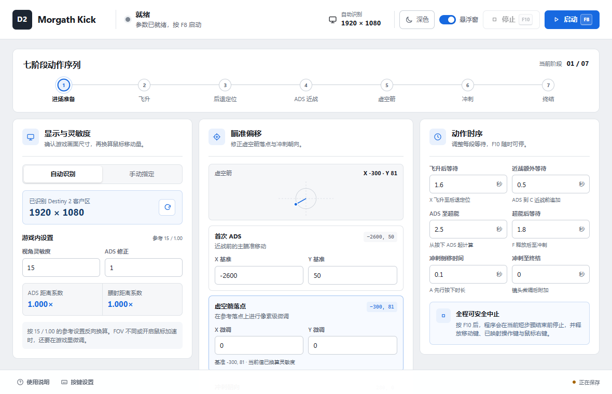

# D2 Morgeth Kick

<p align="center">
  
</p>

[](https://migo-ovo.github.io/D2-Morgeth-Kick/)
[](https://github.com/MIGO-OvO/D2-Morgeth-Kick/releases/latest)
[](https://github.com/MIGO-OvO/D2-Morgeth-Kick/releases/latest)
[](./LICENSE)

## 项目概览 (Overview)

D2 Morgeth Kick 是一款 Windows 动作校准工具。它基于原项目重构，优化了底层架构，安装体积更小。新的 GUI 把分辨率、灵敏度、瞄准偏移、动作等待和按键映射集中在一个窗口里。

这不是自动刷取工具。当前版本不识别 Boss 或玩家状态，也不会自动循环、点击地图或收集掉落。程序只按保存的参数执行一次序列。默认按 F10 会中止当前步骤并释放已按下的键位。

[打开产品门户](https://migo-ovo.github.io/D2-Morgeth-Kick/) · [下载最新 Windows 安装包](https://github.com/MIGO-OvO/D2-Morgeth-Kick/releases/latest/download/D2-Morgeth-Kick-Windows-x64-setup.exe)

<picture>
  <source media="(prefers-color-scheme: dark)" srcset="docs/screenshots/app-dark.png">
  
</picture>

## 功能

- 自动读取 Destiny 2 客户区尺寸，也可手动指定分辨率。
- 按 15 / 1.00 / 100° 参考设置换算 ADS 与腰射移动量，支持自定义 FOV。
- 在“ADS 转向”和“腰射直投”之间切换，并分别保存首次转向校准值。
- 调整首次转向、虚空箭落点和冲刺方向。
- 独立恢复默认动作参数或默认键位，互不覆盖。
- 单独修改六项动作等待时间；终结技完成后流程立即结束。
- 自定义程序启动/停止热键和游戏内操作按键，默认 F8 全局启动、F10 全局中止。
- 中止、报错或退出时释放已按下的键盘与鼠标输入。
- 按 `destiny2.exe` 进程绑定的点击穿透悬浮窗：仅在游戏位于前台时显示，实时跟随客户区中上位置，并可调整透明度。
- 主窗口使用与现有控制台风格一致的自定义标题栏。
- 主窗口支持浅色和深色模式，默认跟随 Windows。
- 窄窗口自动切换为单面板校准界面。
- 启动完成后自动检查 GitHub Release，并在长时间运行时每 12 小时复查；支持稍后提醒、跳过版本和签名验证后的一键更新。

## 运行条件

- 64 位 Windows 10 或 Windows 11
- WebView2 Runtime，大多数 Windows 10/11 系统已经安装
- Destiny 2 使用无边框或窗口模式，以便程序读取客户区尺寸
- 游戏与 D2 Morgeth Kick 使用相同的 Windows 完整性级别

序列依赖游戏内按键、FOV、灵敏度和配装。首次使用前请逐项核对设置，并在可控场景中校准。程序会按设置的 FOV 换算鼠标移动量，实际落点仍建议在游戏内微调。

### 首次启动前准备

1. 腿部护甲装备 3 个运动强化模组，近战属性推荐叠到 140。
2. 装备棱镜分支职业，选择冰飞镖近战、虚空箭超能和飞升星相。
3. 选择首次转向模式：ADS 转向需在二号位装备无礼言论；腰射直投可使用保持第一人称视角的枪械，不要使用刀剑。
4. 调整软件设置中的视角灵敏度/瞄准灵敏度/视野范围与游戏内一致。
5. 确保设置了切换冲刺的按键，游戏内和软件中的冲刺键需为切换冲刺。
6. 进入游戏后不要移动角色或挪动准星，直接按启动热键开始流程。

程序首次启动时会显示同一份检查清单；之后可随时从主界面底部的“使用说明”重新打开。

## 安装 (Installation)

从 [Latest Release](https://github.com/MIGO-OvO/D2-Morgeth-Kick/releases/latest) 下载 `D2-Morgeth-Kick-Windows-x64-setup.exe`，运行安装程序后从开始菜单启动 D2 Morgeth Kick。

Windows 可能会在首次运行未签名安装包时显示 SmartScreen 提示。请核对下载地址是否属于本仓库，再决定是否继续。

### 更新

- 应用启动完成约 4.5 秒后检查一次更新，保持运行时每 12 小时最多复查一次。
- 主界面底部的“检查更新”可以随时手动检查；网络失败不会中断动作流程，也不会显示为动作执行错误。
- 发现新版本后可选择“立即更新”“稍后提醒”或“跳过此版本”。
- 动作序列运行期间不能安装或重启。立即更新前，程序会先中止流程、等待执行线程退出，并释放全部键鼠输入。
- 客户端只读取 GitHub Release 中的 [`latest.json`](https://github.com/MIGO-OvO/D2-Morgeth-Kick/releases/latest/download/latest.json)，安装包通过内置 updater 公钥验证签名，不依赖自建服务器。

v0.3.0 是第一个支持应用内更新的版本。从 v0.2.1 或更早版本升级时，需要先手动安装一次 v0.3.0。

## 使用 (Usage)

1. 启动 Destiny 2，完成上面的首次启动准备，并确认窗口模式、两项灵敏度与 FOV。
2. 打开 D2 Morgeth Kick，检查自动识别到的分辨率。
3. 在“按键设置”中核对程序热键和游戏内操作映射；WASD 无需设置。
4. 按实际情况调整瞄准偏移与等待时间。所有设置会自动保存。
5. 让 Destiny 2 回到前台，保持角色和准星不动，按启动热键执行一次动作序列。
6. 需要停止时按停止热键。悬浮窗会同步显示当前状态。

### 默认按键

| 用途 | 默认按键 | 是否可修改 |
| --- | --- | --- |
| 程序启动 / 停止 | F8 / F10 | 是 |
| 移动 | W / A / S / D | 否，无需设置 |
| ADS（仅 ADS 转向模式） | 鼠标右键 | 否 |
| 切换冲刺 | Shift | 是 |
| 跳跃 | Space | 是 |
| 插旗 / 交互 | E | 是 |
| 切换到 2 号位武器 | 2 | 是 |
| 近战 | C | 是 |
| 飞升 | X | 是 |
| 超能 | F | 是 |
| 终结技 | G | 是 |

## 校准项目

| 分组 | 可调内容 | 说明 |
| --- | --- | --- |
| 显示与灵敏度 | 分辨率、视角灵敏度、瞄准灵敏度、视野范围 (FOV) | 用于换算鼠标移动量 |
| 瞄准偏移 | 首次转向模式、ADS / 腰射独立基准、虚空箭、冲刺方向 | 显示基准值、微调值和最终应用值 |
| 动作时序 | 六项等待参数 | 每项限制在程序允许的范围内；终结动作后立即结束 |

视角灵敏度支持 1–100、步进 1；瞄准灵敏度支持 0.5–1.5、步进 0.1；视野范围支持 55–105、步进 1。

## 开发 (Getting Started / Development)

需要 Node.js、npm、Rust 和 Windows C++ 构建工具。

```powershell
git clone https://github.com/MIGO-OvO/D2-Morgeth-Kick.git
cd D2-Morgeth-Kick
npm install
npm run tauri dev
```

只构建前端：

```powershell
npm run build
```

运行 Rust 测试：

```powershell
cargo test --manifest-path src-tauri/Cargo.toml
```

构建 Windows 安装包：

```powershell
$env:TAURI_SIGNING_PRIVATE_KEY="C:\安全目录\d2-morgeth-kick.key"
npm run tauri build
```

NSIS 安装包及其 updater 签名会出现在 `src-tauri/target/release/bundle/nsis/`。签名私钥不能提交到仓库；丢失私钥后，已安装客户端将无法验证后续更新。

### 发布更新

桌面端直接读取以下 GitHub Release 资产，不需要自建更新服务器：

```text
https://github.com/MIGO-OvO/D2-Morgeth-Kick/releases/latest/download/latest.json
```

将签名私钥内容保存为仓库 Secret `TAURI_SIGNING_PRIVATE_KEY`；如果密钥设置了密码，再配置
`TAURI_SIGNING_PRIVATE_KEY_PASSWORD`。推送 `v*` 标签或手动运行 `Build Windows release` 工作流后，
GitHub Actions 会创建草稿 Release，并上传 NSIS 安装包、`.sig` 和 `latest.json`。核对更新说明和三个资产后再发布草稿，避免客户端读到不完整的 Release。

发布后的 `latest.json`、安装包和 `.sig` 必须属于同一个构建；替换其中任一文件都需要重新签名。v0.3.0 之后的版本可在应用内完成更新。

## 项目架构

D2 Morgeth Kick 由三个表面组成：Tauri 2 桌面壳内运行两个 WebView 窗口（主窗口与悬浮窗），
Rust 核心独占键鼠执行权，`portal/` 是独立的 GitHub Pages 产品门户。

```text
┌──────────────────────────┐   ┌──────────────────────────┐
│ 主窗口 (WebView2 · React) │   │ 悬浮窗 (WebView2 · React) │
│ src/App.tsx              │   │ src/OverlayApp.tsx        │
│ 三栏校准 · 自定义标题栏    │   │ 进程绑定 · 点击穿透 · 只读 │
└────────────┬─────────────┘   └────────────┬─────────────┘
             │ invoke / listen              │ listen
             ▼                              ▼
┌────────────────────────────────────────────────────────────┐
│ Rust 核心 (src-tauri · Tauri 2)                              │
│ lib.rs        命令注册、动态全局热键、窗口生命周期            │
│ engine.rs     七阶段动作序列，每一步都可被取消                │
│ runtime.rs    运行状态机，通过 runtime-state 事件广播         │
│ config.rs     配置校验、持久化、灵敏度换算与偏移计算          │
│ input.rs      SendInput 键鼠输入与兜底释放                   │
│ resolution.rs 识别 Destiny 2 窗口并读取客户区尺寸            │
└────────────┬──────────────────────────────┬────────────────┘
             │ SendInput / EnumWindows      │ 静态发布
             ▼                              ▼
      Destiny 2 游戏窗口           GitHub Pages 门户 (portal/)
```

### 模块职责

| 模块 | 职责 |
| --- | --- |
| `src/`（React 19 + TypeScript + Vite） | 主窗口与悬浮窗界面；`api.ts` 封装 Tauri 通信、updater 下载和浏览器 mock |
| `src-tauri/src/lib.rs` | 注册十个 Tauri 命令，动态注册启停全局热键，并处理窗口关闭或更新安装前的取消、执行线程退出与输入释放 |
| `src-tauri/src/engine.rs` | 七阶段动作序列执行器。等待循环每 10ms 检查一次取消标志，镜头移动拆成小步执行，任何结果下都以 `release_all()` 收尾 |
| `src-tauri/src/runtime.rs` | 以 `Arc<AppState>` 共享配置、状态、更新互斥锁和原子标志。状态变化通过 `runtime-state` 事件同步到主窗口与悬浮窗 |
| `src-tauri/src/config.rs` | `AppConfig` 校验、`settings.json` 读写，以及按参考灵敏度与 FOV 换算 ADS / 腰射距离系数的偏移计算 |
| `src-tauri/src/input.rs` | Windows `SendInput` 封装：扫描码按键、相对鼠标移动，并统一释放 W/A/S/D、当前操作键映射与鼠标右键 |
| `src-tauri/src/resolution.rs` | 枚举可见窗口，按 `destiny2.exe` 进程找到 Destiny 2，读取客户区位置、尺寸与 DPI；找不到时回退到主显示器尺寸 |
| `portal/` | 静态 GitHub Pages 门户：产品介绍、界面预览，并通过 GitHub API 指向最新 Release 下载 |
| `.github/workflows/release.yml` | 在 Windows runner 上测试、构建并签名 NSIS 安装包，生成供 Tauri updater 直接读取的 `latest.json` |

### 执行与状态流

1. Rust 启动时从应用配置目录读取 `settings.json` 并放入 `Arc<AppState>`。
2. 前端通过 `get_config` / `detect_resolution` 初始化；修改参数后防抖 450ms 调 `save_config`，由 Rust 校验后写回 `settings.json`。
3. 点击启动或按当前启动热键时，`running` 原子标志用 `compare_exchange` 防止重复启动，动作引擎在独立线程执行。
4. 引擎切换阶段时更新快照并广播 `runtime-state`，主窗口状态摘要与悬浮窗同步刷新；悬浮窗监视器仅在 Destiny 2 位于前台时将其显示在客户区中上位置。
5. 按当前停止热键置位取消标志，等待与镜头步骤在 10ms 内响应，状态进入「正在停止」并最终释放全部输入。
6. 完成、中止或出错后引擎都会调用 `release_all()`；关闭主窗口同样先取消并释放输入再退出。
7. 安装更新前，Rust 更新互斥锁阻止新序列启动；如已有序列则请求取消、等待退出并再次释放配置中的全部键鼠输入，之后才允许安装或重启。

## 项目结构

```text
D2-Morgeth-Kick/
├── src/                    # React 主窗口、悬浮窗与前端 API
├── src-tauri/              # Rust 动作引擎、配置、输入与 Tauri 设置
├── portal/                 # GitHub Pages 门户页与项目 Logo 主源
├── docs/screenshots/       # README 使用的明暗主题截图
├── .github/workflows/      # GitHub Pages 部署与 Windows 签名发布工作流
├── PRODUCT.md              # 产品事实与范围
├── DESIGN.md               # 设计变量、组件和主题规则
├── LICENSE                 # MIT License
└── README.md
```

## 报告问题 (Issues)

请在 [GitHub Issues](https://github.com/MIGO-OvO/D2-Morgeth-Kick/issues) 提交问题，并附上：

- Windows 版本和系统缩放比例
- Destiny 2 窗口模式与分辨率
- 复现步骤和实际结果
- 错误提示或截图，注意先遮住个人信息

不要在 Issue 中粘贴账号凭据、访问令牌或其他私密数据。

## 贡献 (Contributing)

欢迎提交修复和文档改进。请从新分支开始，保持改动范围清楚，并在 Pull Request 中写明验证命令。涉及动作时序的改动需要同时补充或更新 Rust 测试。

## 致谢 (Acknowledgements)

感谢 [Tauri](https://tauri.app/)、[React](https://react.dev/)、[Vite](https://vite.dev/) 及其开源社区提供的基础设施。

## 许可与声明 (License)

项目使用 [MIT License](./LICENSE)。

D2 Morgeth Kick 是非官方开源项目，与 Bungie 无关联。Destiny 2 及相关名称归其权利人所有。使用本工具前，请自行确认适用的游戏条款并承担使用风险。

## 维护者 (Contact)

GitHub: [@MIGO-OvO](https://github.com/MIGO-OvO)
